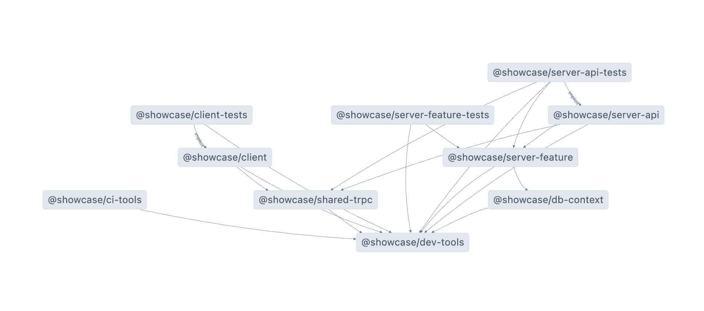

## Setting Up a TypeScript Monorepo: A Quickstart Guide

Blueprint monorepo setup for typescript project to use for a quick start in your projects.

## Why Monorepo?

A monorepo allows you to manage multiple related projects within a single repository. This approach simplifies dependency management, code sharing, and overall project coordination. With TypeScript at its core, you ensure type safety and enhance developer productivity.

## What You'll Need

Our setup leverages:

- [Pnpm](https://pnpm.io/) Workspaces for efficient package management.
- [Nx](https://nx.dev/) for task orchestration across projects.
- [CircleCI](https://circleci.com/) and Docker for continuous integration and deployment.
- [Fastify](https://fastify.dev/) for a speedy backend server.
- [Vite](https://vitejs.dev/) and React for a SPA frontend.
- [Trpc](https://trpc.io/) for type-safe API routes.
- [Liquibase](https://www.liquibase.org/) for database migration management.
- Prettier and ESLint for code formatting and linting.
- Vitest and [Playwright](https://playwright.dev/) for testing.
- Docker Compose for database setup.

## Getting Started

### Step 1: Clone the Repository

First things first, clone the repository to your local machine:

```
git clone <repository_url>
```

Replace <repository_url> with the URL of your monorepo.

### Step 2: Install Dependencies

Navigate into your project directory and install the necessary dependencies using pnpm:

```
cd <project_directory>
pnpm install
```

### Step 3: Kickstart Your Development Environment

Fire up Docker Compose to set up your databases:

```
pnpm run db-start
```

### Step 4: Apply Database Migrations

Use Nx to apply migrations for your server feature:

```
pnpm nx run @showcase/server-feature:db-migrate
```

### Step 5: Launch Development Servers

Start your development servers in watch mode for real-time feedback:

```
pnpm dev
```

## Workflow Commands

Here are some commands to help you manage your development process:

- `pnpm dev`: Run development servers in watch mode.
- `pnpm build`: Create production builds.
- `pnpm test`: Execute all tests.
- `pnpm lint`: Lint your codebase.
- `pnpm type-check`: Perform TypeScript type checking.
- `pnpm pretty`: Format your code.
- `pnpm prepare-ci`: Prepare for CI pipeline.
- `pnpm graph`: Generate a project dependency graph.
- `pnpm check`: Run checks including linting, type checking, and formatting.
- `pnpm clean`: Clean up generated files.

## Customizing Your Setup

This monorepo setup is flexible, allowing you to tweak or extend it based on your project's needs. Whether it's adding new packages, modifying CI/CD pipelines, or incorporating additional tools, the foundation is designed to be adaptable.

## Architecture

The core of the architecture is based on the idea of shared api contract via shared-trpc package and backend modeled as a [loosely coupled monolith](https://codeopinion.com/loosely-coupled-monolith/). Server is separated into separate feature modules with clear ownership of data and simple domain interface. They are then tested via integration test that can test the API just with it's database, without need for more complex setup.



Happy coding!
